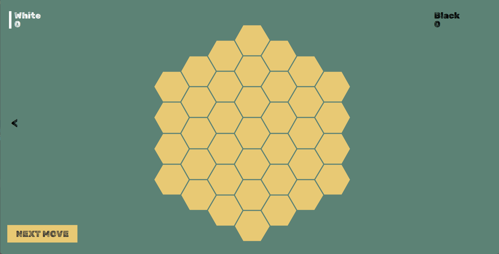

<h2>Contributors</h2>
<ul>
    <li>Tabea Heusel</li>
    <li>Léa Hiebel</li>
    <li>Emre Karabulut</li>
    <li>Aarón Mulvey Izquierdo</li>
    <li>Evgeny Nazarenko</li>
    <li>Jesse Stettner</li>
    <li>Dominic Verschoor</li>
</ul>
<h1>Omega Game</h1>
OMEGA was created as a study of complexity and intuitive arithmetic. Both ideas came together to form this tiny creature. It looks like a mix between Hex and Go.  
On OMEGA, players aim to earn the most points by forming groups of respective colors by arranging stones in a hexagonal grid. However, each participant places stones of all colors in play.  
The final score for each color is calculated by multiplying the sizes of the different groups of that color.(Check the third figure for an example)  
It may be played on a variety of board sizes thanks to the game's six acrylic "corners."  
You will quickly learn that you do not need to evaluate your score while playing (multiplying your group values). Instead, employ an appropriate technique. How? You must solve the problem on your own. 
OMEGA was originally intended for two players, however it also can be played with 3, 4 players.

<h2>How to Run Game </h2>
In order to run the game you should run `UI.Show.main()`   
You will land on the main menu. You can change the board size and player settings.There are several options for the bot if you would like to play against one. 

After clicking "PLAY" button you will see the game board with preferred size (size indicates the radius of the board excluding the center)

<h2>How to Play The Game </h2>
White player starts placing the pieces. 
Each player should play white piece first and black piece after. 
The color bars next to the players' names indicates whose turn and which color will be placed. 
After each move the score of the players are updated.
<h2>How Scores are Counted </h2>
For example in the following board the score white's score is 6 = 1 * 3 * 2 * 1 (white has 4 different clusters with size 1 , 3 , 2 , 1) and the score of black player 8 = 2 * 4 * 1 

After black completes its turn, game ends if there is not enough spaces for all the players to complete their turns. 
Using the arrow on the left part of the screen you can go back to main menu and change the settings. 
_Have Fun!_

