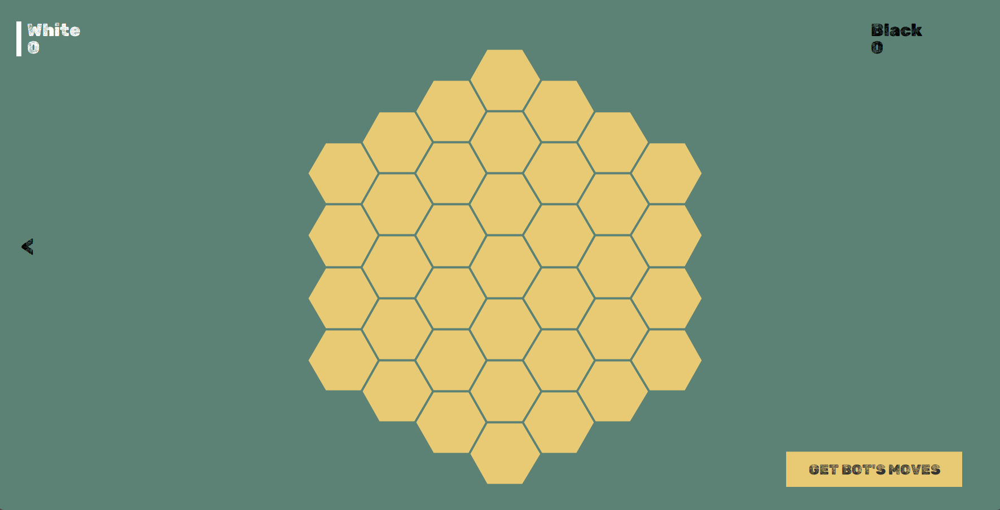

<h1>Omega Game</h1>
OMEGA was created as a study of complexity and intuitive arithmetic. Both ideas came together to form this tiny creature. It looks like a mix between Hex and Go.  
On OMEGA, players aim to earn the most points by forming groups of respective colors by arranging stones in a hexagonal grid. However, each participant places stones of all colors in play.  
The final score of each player is calculated by multiplying the values of the groups of the players.(Check the third figure)  
It may be played on a variety of board sizes thanks to the game's six acrylic "corners."  
You will quickly learn that you do not need to evaluate your score while playing (multiplying your group values). Instead, employ an appropriate technique. How? You must solve the problem on your own. 

<h2>How to Run Game </h2>
In order to run the game you should run `UI.Show.main()`   
You will land on the main menu. You can change the board size and player settings.There are several options for different bots if you would like to play against one. 

After clicking "PLAY" button you will see the game board with preferred size (size indicates the radius of the board excluding the center) 
If there is at least one bot in the game , you will see a button at the right-bottom corner.That allows you to get the bot's moves, when it is bot's turn

<h2>How to Play The Game </h2>
<li> Each player has an allocated color.</li>
<li> White player starts playing by placing the pieces.</li>
<li> Each turn, the current player must place one stone of each color in play on any free spaces on the board.</li>
<li> The color bars ,next to the players' names, indicates whose turn and which color of piece that will be placed.</li>
<li> After each move the score of the players will be updated.</li>
<li> If you are playing against a bot, after you complete your turn you should click the button to "get bot's moves". You will realize that button will turn to blue and will stay blue while the bot is evaluating the board. When the button returns to its original color you can keep playing.</li>
<li> The game ends when, just before white’s turn, it is not possible to play a complete round (all players). For a 2-player game, at least 4 free spaces are needed to play a complete round. </li>
<li> The player with the highest score wins. </li>
<li> In case of a tie, the last of the tied players wins </li>
<h2>How Scores are Counted </h2>
Several groups of connected stones of the same color have been created.The ‘value’ of a group is the number of stones on that group. To calculate your score multiply the values of all the groups of your color. 
For example in the following board the score white's score is 6 = 1 * 3 * 2 * 1 (white has 4 different clusters with size 1 , 3 , 2 , 1) and the score of black player 8 = 2 * 4 * 1 

Using the arrow on the left part of the screen you can go back to main menu and change the settings. 
_Have Fun!_

